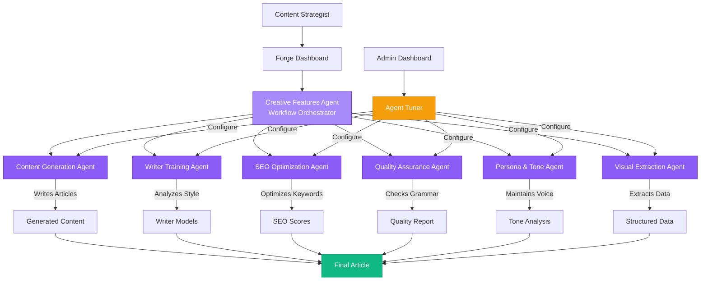

# Forge Multi-Agent AI Architecture

## Agent Responsibilities & Guardrails

### 1. Content Generation Agent
**Primary Role:** Write articles and generate content
**Capabilities:**
- Generates full article drafts
- Follows SmartBrief structure
- Incorporates writer model style
- Includes SEO keywords naturally
- Streams content in real-time

**Guardrails:**
- Cannot modify user accounts
- Cannot change agent configurations
- Cannot access training data directly
- Cannot perform SEO analysis (delegates to SEO Agent)
- Cannot check grammar (delegates to QA Agent)

**Configuration:**
- Model: Claude Sonnet 4
- Temperature: 0.7
- Max Tokens: 4000
- System Prompt: Customizable via Agent Tuner

---

### 2. Writer Training Agent
**Primary Role:** Analyze writer style and create models
**Capabilities:**
- Analyzes tone, voice, vocabulary
- Extracts stylistic patterns
- Creates writer profiles
- Tracks training progress
- Provides style recommendations

**Guardrails:**
- Cannot generate content for users
- Cannot modify existing articles
- Cannot access other users' training data
- Read-only access to published content

**Configuration:**
- Model: Claude Sonnet 4
- Temperature: 0.3 (more analytical)
- Max Tokens: 2000
- Focus: Style analysis, pattern recognition

---

### 3. SEO Optimization Agent
**Primary Role:** Analyze and optimize for search engines
**Capabilities:**
- Keyword density analysis
- Content structure evaluation
- Heading hierarchy validation
- Meta description suggestions
- Internal link recommendations
- Real-time SEO scoring

**Guardrails:**
- Cannot modify content directly
- Cannot generate article text
- Cannot access admin functions
- Provides suggestions only, no automatic changes

**Configuration:**
- Model: Claude Sonnet 4
- Temperature: 0.2 (highly analytical)
- Max Tokens: 1500
- Focus: Technical SEO analysis

---

### 4. Quality Assurance Agent
**Primary Role:** Grammar, spelling, and quality checks
**Capabilities:**
- Grammar checking (LanguageTool integration)
- Spelling validation
- Readability scoring
- Consistency checking
- Fact-checking suggestions
- Style guide compliance

**Guardrails:**
- Cannot modify content directly
- Cannot generate new content
- Cannot override user edits
- Suggestions only, user approves changes

**Configuration:**
- Model: Claude Sonnet 4
- Temperature: 0.1 (very precise)
- Max Tokens: 1000
- Special Config: LanguageTool strictness levels

---

### 5. Persona & Tone Agent
**Primary Role:** Maintain voice and audience adaptation
**Capabilities:**
- Tone analysis and adjustment
- Audience alignment
- Brand voice consistency
- Persona matching
- Emotional intelligence
- Reading level optimization

**Guardrails:**
- Cannot generate full articles
- Cannot access writer training data
- Provides tone feedback only
- Cannot modify SEO settings

**Configuration:**
- Model: Claude Sonnet 4
- Temperature: 0.5
- Max Tokens: 1000
- Focus: Tone, voice, audience

---

### 6. Creative Features Agent
**Primary Role:** Orchestrate workflow and coordinate agents
**Capabilities:**
- Coordinates multi-agent workflows
- Manages task delegation
- Handles complex formatting
- Orchestrates feature interactions
- Error handling and recovery
- Progress tracking

**Guardrails:**
- Cannot modify agent configurations
- Cannot access user data directly
- Cannot override security policies
- Coordinates but doesn't execute content tasks

**Configuration:**
- Model: Claude Sonnet 4
- Temperature: 0.6
- Max Tokens: 2000
- Focus: Workflow orchestration

---

### 7. Visual Extraction Agent
**Primary Role:** Convert images to structured data
**Capabilities:**
- Screenshot analysis (Claude Vision)
- Table extraction from images
- Odds data parsing
- Schedule extraction
- Fallback to GPT-4o Vision if needed
- Data validation and formatting

**Guardrails:**
- Cannot access non-image files
- Cannot modify existing articles
- Cannot generate article content (delegates to Content Agent)
- Limited to data extraction only

**Configuration:**
- Primary: Claude Sonnet 4 Vision
- Fallback: GPT-4o Vision
- Temperature: 0.1 (very precise)
- Max Tokens: 3000
- Special Config: Fallback settings, confidence thresholds

---

## Benefits of Multi-Agent Architecture

### 1. Specialization
- Each agent is optimized for its specific task
- Better results than generic AI
- Faster processing
- More reliable outputs

### 2. Safety & Control
- Guardrails prevent unintended behavior
- Each agent stays within its domain
- Admin can disable/adjust agents independently
- Easier to debug and troubleshoot

### 3. Scalability
- Add new agents without disrupting existing ones
- Agents can be updated independently
- Easy to optimize specific capabilities
- Modular architecture for future expansion

### 4. Transparency
- Clear responsibility for each task
- Easier to understand system behavior
- Better error messages and debugging
- Auditability for compliance

### 5. Performance
- Parallel processing where possible
- Specialized prompts for each task
- Optimized token usage
- Faster overall workflow

---

## Admin Agent Tuner

The Agent Tuner provides real-time control over all agents:

**Configurable Parameters:**
- System Prompt (custom instructions)
- Temperature (creativity vs precision)
- Max Tokens (response length)
- Model Selection (Claude versions)
- Enable/Disable toggle
- Special configurations (per agent)

**Reset to Defaults:**
- One-click restoration of optimal settings
- Safe fallback if configurations cause issues
- Preserves custom settings as backup

**Access Control:**
- Super Admin only (jeremy.botter@gdcgroup.com)
- Audit trail of all changes
- Version history for prompts (planned)

**Real-Time Updates:**
- Changes take effect immediately
- No code deployment needed
- Test changes in real-time
- Rollback instantly if needed
