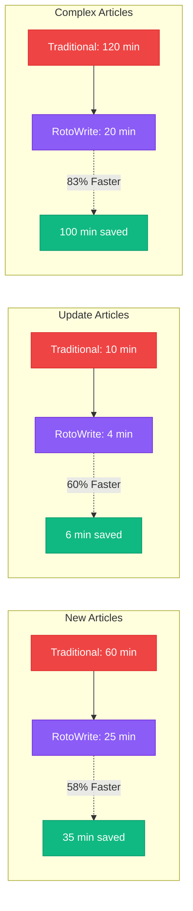
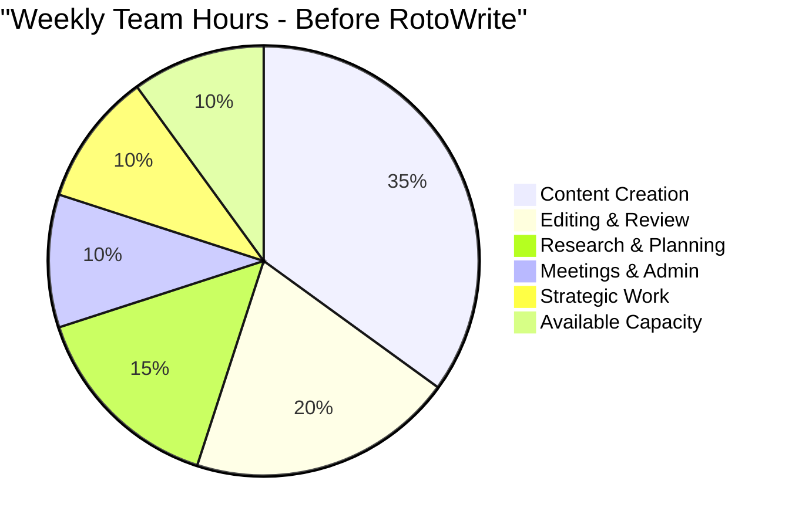
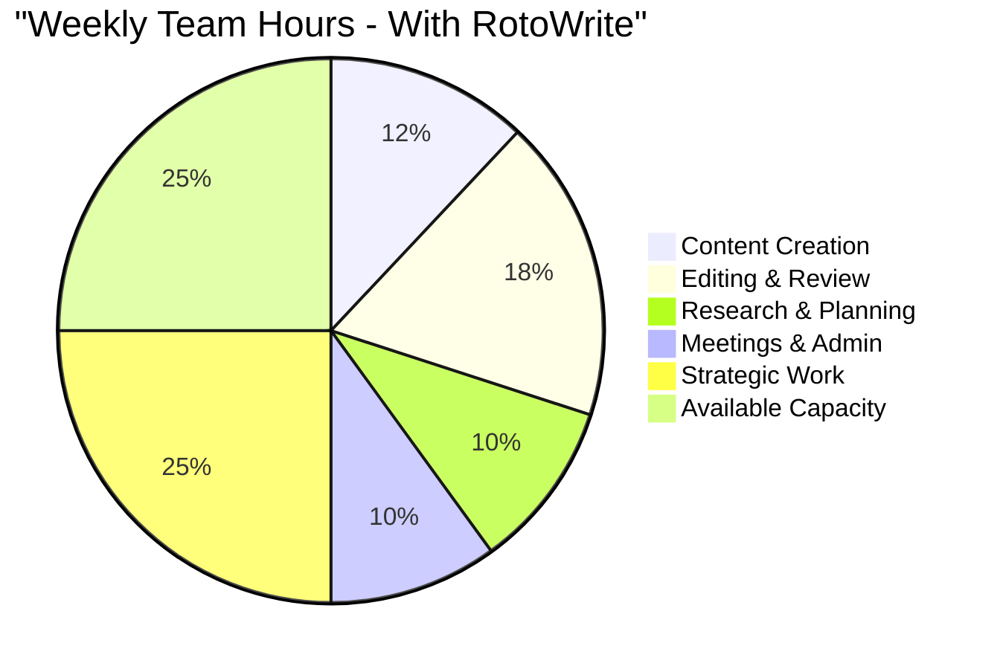
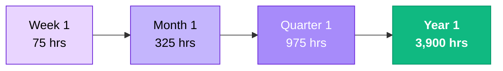
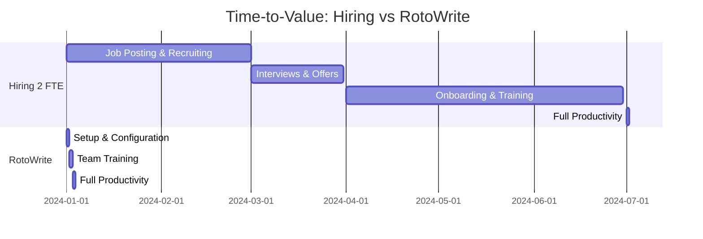

# RotoWrite Time Savings Visualization

## Time Reduction by Content Type

---

## Weekly Time Savings (6-Person Team)

### Typical Weekly Content Production
- **20 New Articles** @ 60 min each = 1,200 min (20 hours)
- **30 Update Articles** @ 10 min each = 300 min (5 hours)
- **5 Complex Articles** @ 120 min each = 600 min (10 hours)
- **Total Traditional Time:** 2,100 minutes = **35 hours per week**

### With RotoWrite
- **20 New Articles** @ 25 min each = 500 min (8.3 hours)
- **30 Update Articles** @ 4 min each = 120 min (2 hours)
- **5 Complex Articles** @ 20 min each = 100 min (1.7 hours)
- **Total RotoWrite Time:** 720 minutes = **12 hours per week**

### Time Saved
- **Per Week:** 23 hours (66% reduction)
- **Per Month:** ~100 hours
- **Per Year:** ~1,200 hours

**For 6-Person Team:**
- **Per Week:** ~75 hours saved
- **Per Month:** ~325 hours saved
- **Per Year:** ~3,900 hours saved

---

## Capacity Impact Visualization

**Key Insight:** Strategic work capacity increases from 10 hours to 25 hours (150% increase), and available capacity for new initiatives increases from 10 to 25 hours.

---

## FTE Equivalent Calculation

### Traditional Workweek: 40 hours
### Time Saved per Week: 75 hours (6-person team)

**FTE Equivalent = 75 hours / 40 hours = 1.875 FTE**

**Translation:** RotoWrite frees up the equivalent of nearly **2 full-time positions** worth of capacity every week.

**Annual Value at $50/hour fully loaded cost:**
- 3,900 hours saved × $50/hour = **$195,000**

---

## Monthly Time Savings Timeline

```mermaid
gantt
    title Time Saved Per Month with RotoWrite
    dateFormat X
    axisFormat %H hours
    
    section Week 1
    Time Saved   :0, 75
    
    section Week 2
    Time Saved   :0, 75
    
    section Week 3
    Time Saved   :0, 75
    
    section Week 4
    Time Saved   :0, 75
    
    section Week 5
    Time Saved   :0, 25
```

**Total Monthly Savings:** ~325 hours
**Annual Projection:** ~3,900 hours

---

## Time Savings by Task Breakdown

### New Article Creation (60 min → 25 min)

**Traditional Process:**
- Research & outline: 15 min
- Drafting: 30 min
- SEO optimization: 10 min
- Editing & revision: 5 min

**RotoWrite Process:**
- Create project & generate: 5 min
- Review AI draft: 10 min
- Edit & refine: 8 min
- SEO Wizard check: 2 min

**Time Saved:** 35 minutes per article (58% faster)

---

### Update Article (10 min → 4 min)

**Traditional Process:**
- Open old article: 1 min
- Update facts/dates: 4 min
- SEO re-check: 3 min
- Re-publish: 2 min

**RotoWrite Process:**
- Open project: 1 min
- Edit with AI assistance: 2 min
- SEO Wizard instant check: 1 min

**Time Saved:** 6 minutes per article (60% faster)

---

### Complex Data Article - NFL Odds (120 min → 20 min)

**Traditional Process:**
- Collect ESPN schedule data: 15 min
- Transcribe schedule info: 15 min
- Collect RotoWire odds data: 10 min
- Transcribe odds info: 20 min
- Build tables (14+ games): 40 min
- Format headers/sections: 10 min
- Write predictions: 10 min

**RotoWrite Process:**
- Upload ESPN screenshot: 1 min
- Upload odds screenshots: 1 min
- AI extraction & generation: 3 min
- Review & adjust tables: 5 min
- Write predictions: 10 min

**Time Saved:** 100 minutes per article (83% faster)

---

## Cumulative Annual Savings

**3,900 hours annually = equivalent value of $195,000 in reclaimed capacity**

---

## Productivity Multiplier Effect

### Content Output Capacity

**Before RotoWrite:**
- 6 strategists
- 55 articles per week (team total)
- ~9 articles per person per week

**With RotoWrite (same 6 people):**
- Same 6 strategists
- **88 articles per week** (60% increase)
- ~15 articles per person per week

**OR maintain 55 articles/week and reallocate saved time to:**
- In-depth research
- Strategic planning
- Audience engagement
- New content verticals
- Training and development

---

## Break-Even Analysis

### Cost to Operate RotoWrite
- **Monthly:** ~$50
- **Annual:** ~$600

### Value Created (First Week)
- **75 hours saved** × $50/hour = **$3,750**

### Break-Even Point
- $600 annual cost / $3,750 weekly value = **0.16 weeks**
- **Break-even in less than 2 days of use**

### Return on Investment
- **Annual Value:** $195,000
- **Annual Cost:** $600
- **Net Value:** $194,400
- **ROI:** 32,400%

Every $1 spent returns $325 in value.

---

## Comparison to Hiring

### Option 1: Hire 2 Additional Strategists
- **Annual Salary (2 FTE):** ~$140,000
- **Benefits & Overhead:** ~$40,000
- **Recruiting Costs:** ~$20,000
- **Training Time:** 3-6 months
- **Total First-Year Cost:** ~$200,000
- **Ongoing Annual Cost:** ~$180,000

### Option 2: Deploy RotoWrite
- **First-Year Cost:** $600
- **Training Time:** 1 hour per user
- **Capacity Equivalent:** 1.875 FTE
- **Ongoing Annual Cost:** $600

**Savings vs Hiring:** $199,400 in first year, $179,400 annually thereafter

---

## Time-to-Value Comparison

**Hiring Path:** 6 months to full productivity
**RotoWrite Path:** 2 days to full productivity

---

## Summary: The Time Savings Advantage

1. **Immediate Impact:** Saves 75 hours per week from day one
2. **Consistent Savings:** Every week, every month, every year
3. **Scalable:** Works for teams of any size
4. **Cumulative:** 3,900 hours saved annually compounds over time
5. **Measurable:** Easy to track and quantify ROI
6. **Low Risk:** Minimal cost, instant break-even, easy rollback

**Bottom Line:** RotoWrite delivers the capacity equivalent of 2 FTE positions at a fraction of the cost of hiring, with immediate time-to-value.
