# Forge Content Creation Workflow

## Traditional Workflow vs Forge

```mermaid
gantt
    title Time Comparison: Traditional vs Forge
    dateFormat X
    axisFormat %M min
    
    section Traditional
    Manual Research           :0, 15
    Drafting Article          :15, 30
    SEO Optimization          :45, 10
    Editing & Revisions       :55, 15
    Formatting for CMS        :70, 5
    
    section Forge
    Create Project            :0, 2
    Auto-Research (NewsEngine):2, 1
    AI Generation             :3, 3
    Review & Edit             :6, 10
    SEO Wizard Check          :16, 2
    One-Click Export          :18, 1
```

**Traditional Process:** 75 minutes average
**Forge Process:** 19 minutes average
**Time Saved:** 56 minutes (75% reduction)

---

## Detailed Step-by-Step Workflow

### Step 1: Create Project (2 minutes)
- Enter headline and primary keyword
- Add secondary keywords (comma-separated)
- Set word count target
- Add topic/additional details

### Step 2: Select Writer Model (30 seconds)
- Choose your personal AI writer model
- Pre-trained on your writing style
- System automatically suggests your model

### Step 3: Choose SmartBrief (30 seconds)
- Browse available content templates
- Filter by category or type
- Select brief that matches article type

### Step 4: Auto-Research - NewsEngine (1 minute)
- System automatically searches for relevant news
- Uses headline + keywords + topic
- Displays recent articles from past 3 weeks
- Sources ready to reference

### Step 5: Generate Content (3 minutes)
- Click "Generate Content" button
- AI retrieves your training examples
- Content streams in real-time in your voice
- Follows SmartBrief structure automatically
- Incorporates news sources and SEO keywords

### Step 6: SEO Optimize (2 minutes)
- SEO Wizard analyzes content automatically
- Real-time keyword density tracking
- Content structure validation
- Auto-Optimize button for one-click improvements
- Live score updates as you type

### Step 7: Edit & Refine (10 minutes)
- Rich text editor with full formatting
- Add your expert analysis and insights
- Adjust any AI-generated sections
- Insert internal links
- Auto-save every 2 seconds

### Step 8: Export to CMS (1 minute)
- Click Export button in toolbar
- Choose "Copy for RotoWire CMS"
- Content automatically formatted for CKEditor
- Tables, headers, lists all properly structured
- One-click copy to clipboard

### Step 9: Publish (immediate)
- Paste into RotoWire CMS
- All formatting preserved perfectly
- No manual adjustments needed
- Publish immediately

**Total Time: 15-20 minutes** (vs 60-120 minutes traditional)
