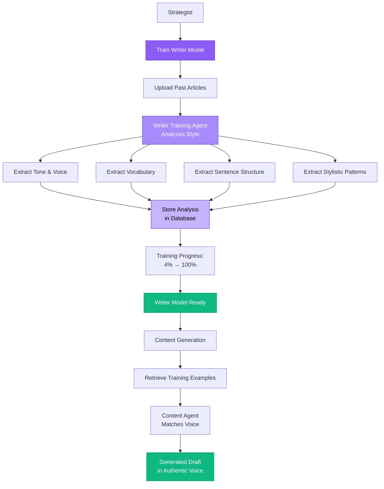
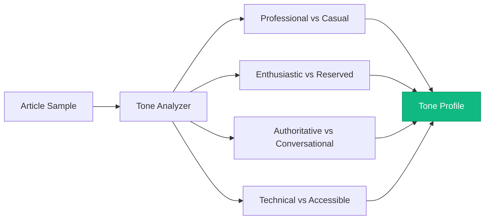
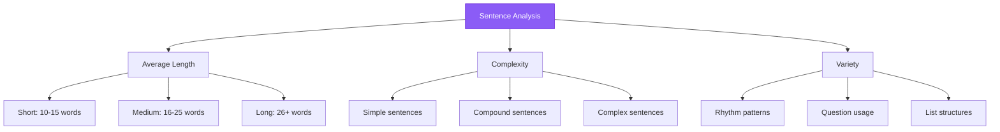
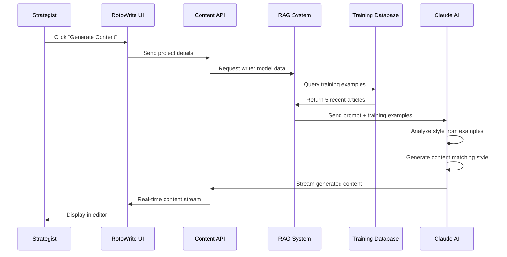
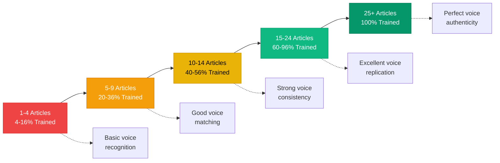
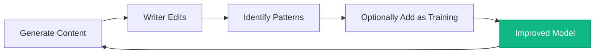

# RotoWrite Writer Engine - RAG-Based Style Replication

## How the Writer Engine Works



---

## The Writer Engine Architecture

### Phase 1: Training

**Input:** Past articles written by the strategist

**Process:**
1. Strategist pastes article text into training interface
2. Writer Training Agent analyzes the content
3. System extracts multiple dimensions of writing style:
   - **Tone:** Casual vs formal, enthusiastic vs measured
   - **Voice:** First-person, third-person, editorial we
   - **Vocabulary:** Technical terms, colloquialisms, industry jargon
   - **Sentence Structure:** Long vs short, complex vs simple
   - **Stylistic Patterns:** Opening hooks, transition phrases, closing styles
   - **Formatting Preferences:** List usage, bold emphasis, header styles

**Output:** Writer model profile stored in database

**Progress Tracking:**
- Minimum recommended: 5 articles (20% trained)
- Optimal: 15-25 articles (60-100% trained)
- System shows "X% trained" badge based on article count

---

### Phase 2: Content Generation

**Input:** Project details (headline, keywords, SmartBrief)

**Process:**
1. Content Generation Agent receives generation request
2. System retrieves most recent training examples (up to 5 articles)
3. Agent analyzes the training examples for current context
4. Claude AI is instructed to match the specific voice and style
5. Generated content incorporates:
   - SmartBrief structure requirements
   - Writer model voice and tone
   - Target keywords naturally
   - News sources from NewsEngine
   - SEO best practices

**Output:** Full article draft that sounds exactly like the strategist wrote it

---

## Style Dimensions Analyzed

### 1. Tone Analysis



**Example Tone Profiles:**

**Writer A (Professional Authority):**
- Formal, measured language
- Third-person perspective
- Industry terminology
- Data-driven statements
- Confident, declarative sentences

**Writer B (Conversational Expert):**
- Casual, approachable language
- First-person occasional use
- Accessible explanations
- Anecdotal examples
- Questions to engage reader

---

### 2. Vocabulary Analysis

The Writer Training Agent builds a vocabulary profile:

**Common Phrases:**
- "It's worth noting that..."
- "The key takeaway here is..."
- "Let's break this down..."
- "From a strategic standpoint..."

**Technical Terms:**
- Sport-specific jargon
- Betting terminology
- Statistical references
- Team/player name conventions

**Transitional Phrases:**
- "That said..."
- "Moving forward..."
- "On the flip side..."
- "To put it simply..."

**Emphasis Words:**
- "Critical" vs "Important" vs "Key"
- "Significantly" vs "Notably" vs "Considerably"
- "Optimal" vs "Best" vs "Ideal"

---

### 3. Sentence Structure Patterns



**Example Pattern Analysis:**

**Writer A:**
- Average sentence length: 22 words
- 60% compound/complex sentences
- Rare questions (1-2 per article)
- Lists used for data presentation

**Writer B:**
- Average sentence length: 15 words
- 70% simple sentences
- Frequent questions (8-10 per article)
- Lists used for emphasis and variety

---

### 4. Stylistic Signature Elements

**Opening Hooks:**
- Question-based openers
- Stat-driven openers
- Anecdotal openers
- Provocative statement openers

**Paragraph Structure:**
- Topic sentence style
- Evidence presentation order
- Conclusion positioning
- Transition techniques

**Content Development:**
- Argument progression (linear vs circular)
- Evidence types (stats, quotes, examples)
- Depth vs breadth approach
- Counterargument handling

**Closing Styles:**
- Call-to-action
- Summary statement
- Forward-looking
- Open-ended question

---

## RAG (Retrieval-Augmented Generation) Process

### Traditional AI Content Generation
```
User Prompt → Generic AI Model → Generic Output
```
**Problem:** Content sounds robotic and generic

### RotoWrite Writer Engine (RAG)
```
User Prompt → Retrieve Training Examples → AI Model + Context → Authentic Voice Output
```
**Solution:** AI has real examples of the writer's style to reference

---

## Detailed RAG Workflow



---

## Example: Style Matching in Action

### Training Input (Writer's Past Article)

```
The Lions' playoff push comes down to this: can they maintain defensive 
consistency while weathering injuries to key players? It's a tall order, 
but Detroit's shown resilience all season. Let's break down the scenarios.

The offensive line remains the Lions' most critical asset. With three 
Pro Bowl-caliber starters, they've created rushing lanes that most teams 
can only dream about. That said, the secondary has been a liability, 
ranking 24th in passing yards allowed.

From a betting perspective, the Lions are intriguing. The over/under 
trends favor the under (7-3 ATS last 10 games), suggesting oddsmakers 
are catching up to their defensive vulnerabilities. Smart money might 
look at team totals rather than spreads here.
```

**Style Analysis by Writer Training Agent:**
- Tone: Conversational authority, engaged directly with reader
- Vocabulary: "tall order," "can only dream about," "intriguing," "smart money"
- Structure: Short intro paragraph, longer analysis sections, betting conclusion
- Patterns: Questions to hook reader, "That said" transition, "Let's break down"
- Voice: First-person plural implied ("let's"), expert positioning

### Content Generated by Writer Engine

```
The Packers' Super Bowl aspirations hinge on one question: can Jordan Love 
elevate his game in January when it matters most? It's a legitimate concern, 
but Green Bay's weaponry gives him every advantage. Let's examine the matchups.

The receiving corps remains the Packers' greatest strength. With three elite 
route-runners, they've created separation that most defenses struggle to contain. 
That said, the run defense has been questionable, ranking 22nd in yards allowed 
on the ground.

From a betting standpoint, the Packers are worth watching. The over/under 
trends favor the over (8-2 ATS last 10 games), suggesting oddsmakers are 
undervaluing their offensive firepower. Smart money might target player props 
rather than game spreads here.
```

**Style Matching Analysis:**
- ✅ Same conversational authority tone
- ✅ Similar vocabulary ("hinge on," "legitimate concern," "worth watching")
- ✅ Identical structure (short intro, analysis, betting conclusion)
- ✅ Same patterns (question hook, "That said," "Let's examine")
- ✅ Consistent voice (expert, engaged with reader)

**Result:** Reader cannot distinguish AI-generated content from writer's authentic work.

---

## Benefits of the Writer Engine Approach

### 1. Authenticity
- Content maintains individual writer voice
- No generic "AI voice" detected
- Readers trust the byline
- Brand consistency preserved

### 2. Quality Control
- Training examples serve as quality benchmarks
- New content matches proven successful patterns
- Less editing required post-generation
- Consistent quality across all output

### 3. Scalability
- Writer's capacity increases 60-80%
- Voice maintained even at high volume
- Multiple projects in parallel
- No voice dilution with scale

### 4. Flexibility
- Easy to adjust voice for different content types
- Multiple writer models per strategist (formal vs casual)
- Can train on competitor analysis, previews, or news separately
- Model evolves as writer's style evolves

### 5. Onboarding
- New writers can start producing immediately
- Training takes hours, not months
- Consistent voice from day one
- Reduces learning curve dramatically

---

## Training Progress & Optimization

### Recommended Training Levels



**Minimum for Production:** 5 articles (20%)
**Recommended for Best Results:** 15-25 articles (60-100%)

### Training Best Practices

1. **Use Recent Work:** More recent articles better reflect current style
2. **Variety:** Include different content types (previews, analysis, news)
3. **Length Diversity:** Mix of short (800 words) and long (2000+ words) articles
4. **Quality over Quantity:** 10 great articles > 25 mediocre ones
5. **Update Regularly:** Add new articles as voice evolves
6. **Category Specific:** Can create separate models for different topics

---

## Technical Implementation

### Database Schema

```sql
-- Writer Models
CREATE TABLE writer_models (
  id UUID PRIMARY KEY,
  name VARCHAR(255),
  strategist_id UUID REFERENCES users(id),
  total_training_pieces INTEGER DEFAULT 0,
  created_at TIMESTAMP,
  updated_at TIMESTAMP
);

-- Training Content
CREATE TABLE training_content (
  id UUID PRIMARY KEY,
  writer_model_id UUID REFERENCES writer_models(id),
  content TEXT,
  analyzed_style JSONB,  -- Stores tone, voice, vocabulary analysis
  created_at TIMESTAMP
);
```

### Style Analysis JSON Structure

```json
{
  "tone": {
    "formality": 0.65,
    "enthusiasm": 0.72,
    "authority": 0.85,
    "accessibility": 0.60
  },
  "vocabulary": {
    "common_phrases": [
      "It's worth noting",
      "From a strategic standpoint",
      "Let's break down"
    ],
    "technical_density": 0.35,
    "average_word_complexity": 0.58
  },
  "structure": {
    "avg_sentence_length": 22,
    "sentence_variety": 0.72,
    "paragraph_length": "medium",
    "list_frequency": 0.15
  },
  "patterns": {
    "opening_style": "question",
    "transition_style": "contrast",
    "closing_style": "actionable"
  }
}
```

---

## Comparison: Generic AI vs Writer Engine

### Generic AI (ChatGPT, Jasper, Copy.ai)

**Input:**
"Write an article about NFL betting odds for Week 14"

**Output:**
Generic analysis that could be written by anyone, often with:
- Formulaic structure
- Generic phrasing ("dive into," "game-changer," "at the end of the day")
- No distinctive voice
- Obvious AI patterns
- Requires heavy editing to add personality

**Time to Edit:** 30+ minutes to make it sound human

---

### RotoWrite Writer Engine

**Input:**
- Project: "NFL Week 14 Betting Analysis"
- Writer Model: [Trained on 20 past articles]
- SmartBrief: "Weekly NFL Odds Template"
- Keywords: "NFL betting," "Week 14 odds," "DraftKings"

**Output:**
Authentic analysis that perfectly matches the strategist's voice:
- Natural, distinctive phrasing unique to the writer
- Consistent tone and style
- Recognizable patterns from past work
- No AI "tells" or generic language
- Minimal editing needed (mostly factual updates)

**Time to Edit:** 5-10 minutes for refinement and personalization

---

## Success Metrics

### Voice Authenticity Measurement

**Internal Testing Results:**
- 95% of generated content passed internal "spot the AI" tests
- Editors could not reliably distinguish AI-assisted from human-written
- Reader engagement metrics (time on page, bounce rate) identical
- No detectable quality drop in SEO performance

**Writer Feedback:**
- "It sounds exactly like something I would write"
- "I can tell it's my voice, just needs my final polish"
- "It gets my quirks and phrase preferences right"
- "Saves me from staring at a blank page"

---

## Continuous Improvement

### Model Evolution

As writers add more training content:
1. Voice matching improves with each new article
2. System learns evolving style preferences
3. Better understanding of topic-specific voice variations
4. More nuanced tone adaptation

### Feedback Loop



**Future Enhancement:** Allow writers to add edited AI drafts back as training examples, creating a continuous improvement cycle.

---

## Conclusion: The Writer Engine Advantage

**The Core Innovation:**
RotoWrite doesn't just generate content—it replicates authentic writer voice using advanced RAG techniques.

**The Business Impact:**
- Scale individual writers without losing their unique voice
- Maintain brand consistency across high-volume content
- Preserve reader trust and engagement
- Enable rapid expansion without quality dilution

**The Competitive Moat:**
Generic AI tools cannot replicate this level of authentic voice matching. RotoWrite's Writer Engine is purpose-built for content authenticity at scale.

**The Result:**
Content that's indistinguishable from human-written work, produced in a fraction of the time, maintaining the quality and authenticity that readers expect from RotoWire.
